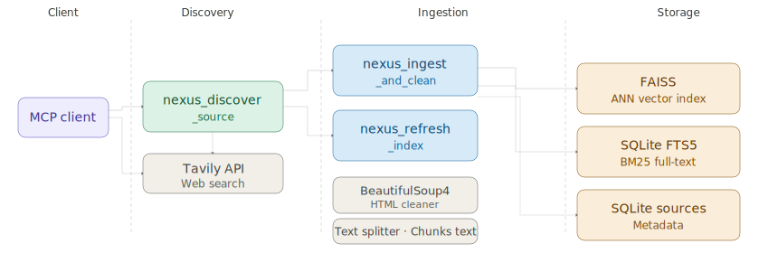
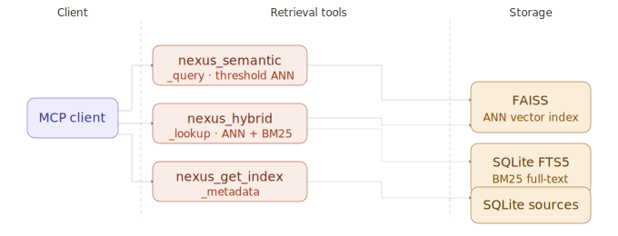
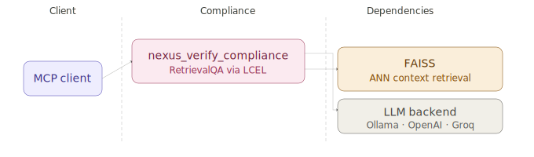

NEXUS Core is an autonomous, deterministic RAG server that exposes verified documentation
through the Model Context Protocol (MCP). Every response is grounded exclusively in indexed
sources — the system never speculates beyond the available evidence.

---


## Table of Contents

- [Overview](#overview)
- [Architecture](#architecture)
- [Requirements](#requirements)
- [Installation](#installation)
- [Configuration](#configuration)
- [Getting Started](#getting-started)
- [Starting the Server](#starting-the-server)
- [MCP Tools Reference](#mcp-tools-reference)
- [Example Workflow](#example-workflow)
- [Embedding Providers](#embedding-providers)
- [LLM Providers](#llm-providers)
- [Determinism Guarantees](#determinism-guarantees)
- [Project Structure](#project-structure)
- [License](#license)

---

## Overview

NEXUS Core ingests documentation from public URLs, stores chunks in a FAISS vector index
and a SQLite FTS5 full-text index, and answers queries exclusively from that indexed content.
It is consumed by any MCP-compatible client such as Claude Desktop, VS Code with Copilot, or
a custom agent.

---

## Architecture

**Discovery & Ingestion**



**Retrieval**



**Compliance**



---

## Requirements

- Python 3.11 or later
- SQLite compiled with FTS5 support (standard in CPython distributions)
- A Tavily API key for `nexus_discover_source`
- One of: a local Ollama instance, an OpenAI API key, or a Groq API key

---

## Installation

Create a virtualenv, activate it, and run `pip install -r requirements.txt`.

---

## Configuration

Copy `.env.template` to `.env` and fill in credentials.

Key variables:

| Variable | Default | Description |
|---|---|---|
| `TAVILY_API_KEY` | _(empty)_ | Required for `nexus_discover_source` |
| `EMBEDDING_SOURCE` | `OLLAMA` | `OLLAMA` or `OPENAI` |
| `OLLAMA_BASE_URL` | `http://localhost:11434` | Ollama server endpoint |
| `OLLAMA_EMBEDDING_MODEL` | `nomic-embed-text` | Ollama embedding model |
| `OPENAI_API_KEY` | _(empty)_ | Required when `EMBEDDING_SOURCE=OPENAI` |
| `OPENAI_EMBEDDING_MODEL` | `text-embedding-3-small` | OpenAI embedding model |
| `LLM_PROVIDER` | `OLLAMA` | `OLLAMA`, `OPENAI`, or `GROQ` |
| `LLM_MODEL` | `llama3` | Model name passed to the provider |
| `GROQ_API_KEY` | _(empty)_ | Required when `LLM_PROVIDER=GROQ` |
| `NEXUS_STORAGE_PATH` | `data/indices` | Directory for FAISS index shards |
| `SQLITE_DB_PATH` | `data/nexus.db` | SQLite database file |
| `NEXUS_SIMILARITY_THRESHOLD` | `0.7` | Minimum relevance score for results |

---

## Getting Started

This section walks you from a fresh installation to a first verified query in five steps.

**Step 1 — Install:** Clone the repository, create a virtualenv, and run `pip install -r requirements.txt`.

**Step 2 — Configure:** Copy `.env.template` to `.env` and set at minimum `TAVILY_API_KEY`, `LLM_PROVIDER`, and `LLM_MODEL`. See the [Configuration](#configuration) table for all options.

**Step 3 — Start the server:** Run `python server.py`. The server listens on `http://0.0.0.0:8765/mcp`.

**Step 4 — Register in VS Code:** Add an entry to `.vscode/mcp.json` with `type: http` and `url: http://localhost:8765/mcp`.

**Step 5 — Index and query:** Call `nexus_discover_source` to find the documentation URL, `nexus_ingest_and_clean` to index it, and `nexus_verify_compliance` to check code against the indexed content.

---

## Starting the Server

Run `python server.py`. The server starts on `http://0.0.0.0:8765/mcp` using the `streamable-http` transport.

---

## MCP Tools Reference

### nexus_discover_source

Searches for official documentation URLs for a given framework using Tavily.
Results are ranked by source quality: `llms.txt` > GitHub Markdown > HTML documentation pages.

**Parameters**

| Name | Type | Required | Description |
|---|---|---|---|
| `framework` | string | yes | Framework or library name, e.g. `fastapi` |
| `hint` | string | no | Additional search term or domain hint |

**Returns** `recommended_url`, `all_candidates` (up to 10 ranked URLs)

---

### nexus_ingest_and_clean

Fetches a URL, strips navigation and layout noise with BeautifulSoup4, splits the text into
overlapping chunks, embeds them, and persists the result to both FAISS and SQLite FTS5.
Re-ingestion is skipped when the SHA-256 checksum of the raw HTML is unchanged.

**Parameters**

| Name | Type | Required | Description |
|---|---|---|---|
| `framework` | string | yes | Namespace for this documentation corpus |
| `url` | string | yes | Publicly reachable documentation URL |

**Returns** `status` (`ingested` or `unchanged`), `chunk_count`, `checksum`, `ingested_at`

---

### nexus_semantic_query

Runs FAISS approximate nearest-neighbour search and returns results whose relevance score
meets or exceeds `NEXUS_SIMILARITY_THRESHOLD`. No result is returned below the threshold —
the response contains a structured message instead.

**Parameters**

| Name | Type | Required | Description |
|---|---|---|---|
| `framework` | string | yes | Framework namespace to search |
| `query` | string | yes | Natural-language or code-fragment query |
| `k` | integer | no | Maximum results (default: 5) |

---

### nexus_hybrid_lookup

Combines semantic FAISS results with FTS5 BM25 keyword results, deduplicates by content,
and returns a merged list. Semantic matches take priority; keyword-only matches are appended.

**Parameters**

| Name | Type | Required | Description |
|---|---|---|---|
| `framework` | string | yes | Framework namespace to search |
| `query` | string | yes | Search string |
| `k` | integer | no | Maximum results per strategy (default: 5) |

---

### nexus_verify_compliance

Retrieves the most relevant documentation chunks for a code snippet and passes them, together
with the snippet, to the configured LLM via an LCEL chain. The LLM is instructed to use only
the provided context.

**Possible verdicts:** `COMPLIANT`, `NON-COMPLIANT`, `PARTIAL`, `INSUFFICIENT_DOCUMENTATION`

**Parameters**

| Name | Type | Required | Description |
|---|---|---|---|
| `framework` | string | yes | Framework namespace to check against |
| `code_snippet` | string | yes | Code fragment to verify |

---

### nexus_get_index_metadata

Returns the contents of the SQLite metadata registry. Each record includes framework,
URL, SHA-256 checksum, ingestion timestamp, and chunk count.

**Parameters**

| Name | Type | Required | Description |
|---|---|---|---|
| `framework` | string | no | Filter to a specific framework; omit for all |

---

### nexus_refresh_index

Fetches the current content of a URL, computes its checksum, and compares it with the stored
value. Re-ingestion is triggered only when the content has actually changed.

**Parameters**

| Name | Type | Required | Description |
|---|---|---|---|
| `framework` | string | yes | Framework namespace the URL belongs to |
| `url` | string | yes | Documentation URL to check |

**Returns** `refresh_action` (`no_change`, `re_ingested`, or `initial_ingest`), `message`

---

## Example Workflow

1. Call `nexus_discover_source("fastapi")` to get the recommended documentation URL.
2. Call `nexus_ingest_and_clean("fastapi", "<url>")` to index the content into FAISS and FTS5.
3. Call `nexus_semantic_query("fastapi", "<query>")` or `nexus_hybrid_lookup` to retrieve relevant chunks.
4. Call `nexus_verify_compliance("fastapi", "<code>")` to get a deterministic compliance verdict.
5. Call `nexus_refresh_index` periodically to detect and re-ingest changed pages.

---

## Usage Example — "How do I initialise an LLM in LangChain?"

The following is a **real session** against the live NEXUS server at
`https://nexus.herman-tsago.tech/mcp`. No training data was used — every answer
comes exclusively from the indexed documentation.

### Step 1 — Index the documentation

```
nexus_ingest_and_clean(
    framework = "langchain",
    url       = "https://python.langchain.com/docs/concepts/chat_models/"
)
```

**Result:** `status: ingested`, `chunk_count: 54`

### Step 2 — Query the index

```
nexus_hybrid_lookup(
    framework = "langchain",
    query     = "LLM ChatModel initialize instantiate example"
)
```

**Top result** (`chunk_id: 2`, `similarity_score: 0.4762`, source: `python.langchain.com`):

> *"The easiest way to get started with a standalone model in LangChain is to use
> `init_chat_model` to initialize one from a chat model provider of your choice."*

### Step 3 — Use the answer

The retrieved chunks contain the following verified patterns:

**Universal — `init_chat_model` (recommended)**

```python
from langchain.chat_models import init_chat_model

# OpenAI
model = init_chat_model("gpt-4.1")                    # OPENAI_API_KEY env var

# Anthropic
model = init_chat_model("claude-sonnet-4-6")           # ANTHROPIC_API_KEY env var

# Azure OpenAI
model = init_chat_model(
    "azure_openai:gpt-4.1",
    azure_deployment=os.environ["AZURE_OPENAI_DEPLOYMENT_NAME"],
)

# AWS Bedrock
model = init_chat_model(
    "anthropic.claude-3-5-sonnet-20240620-v1:0",
    model_provider="bedrock_converse",
)

# HuggingFace
model = init_chat_model(
    "microsoft/Phi-3-mini-4k-instruct",
    model_provider="huggingface",
    temperature=0.7,
    max_tokens=1024,
)
```

**Direct class instantiation**

```python
from langchain_openai import ChatOpenAI
from langchain_anthropic import ChatAnthropic
from langchain_ollama import ChatOllama

model = ChatOpenAI(model="gpt-4.1", api_key="sk-...")
model = ChatAnthropic(model="claude-sonnet-4-6")
model = ChatOllama(model="llama3.2", base_url="http://localhost:11434")
```

**Invoke**

```python
from langchain_core.messages import SystemMessage, HumanMessage

response = model.invoke([
    SystemMessage("You are a helpful assistant."),
    HumanMessage("Explain LangChain in one sentence."),
])
print(response.content)
```

Every code snippet above was retrieved verbatim from the indexed page —
**not generated from model weights**.

---

## Embedding Providers

| `EMBEDDING_SOURCE` | Model | Notes |
|---|---|---|
| `OLLAMA` | `nomic-embed-text` | Requires a running `ollama serve` instance |
| `OPENAI` | `text-embedding-3-small` | Highest quality; requires `OPENAI_API_KEY` |

---

## LLM Providers

| `LLM_PROVIDER` | Notes |
|---|---|
| `OLLAMA` | Local model via Ollama; no API key required |
| `OPENAI` | Requires `OPENAI_API_KEY` |
| `GROQ` | Requires `GROQ_API_KEY`; fast inference |

---

## Determinism Guarantees

- A URL whose raw HTML has an unchanged SHA-256 checksum is never re-processed.
- Queries that produce no results above `NEXUS_SIMILARITY_THRESHOLD` return a structured
  message; the server never fabricates answers.
- `nexus_verify_compliance` returns `INSUFFICIENT_DOCUMENTATION` when the index does not
  cover the code under review; it does not speculate.
- Every ingestion event is recorded in SQLite with checksum, chunk count, and UTC timestamp.

---

## Project Structure

```
/opt/nexus/
├── server.py                  # FastMCP entry point; auto-discovers tool modules
├── requirements.txt
├── .env.template
├── src/
│   ├── config.py              # pydantic-settings configuration
│   ├── db.py                  # SQLite schema and query helpers
│   ├── embeddings.py          # Embedding provider factory
│   ├── llm.py                 # LLM provider factory
│   ├── models.py              # Pydantic output models for all tools + compliance prompt
│   ├── ingestion.py           # Fetch -> clean -> chunk -> index pipeline
│   ├── retrieval.py           # semantic_query, hybrid_lookup, verify_compliance
│   └── tools/
│       ├── discover.py        # nexus_discover_source
│       ├── ingest.py          # nexus_ingest_and_clean
│       ├── query.py           # nexus_semantic_query, nexus_hybrid_lookup
│       ├── compliance.py      # nexus_verify_compliance
│       ├── metadata.py        # nexus_get_index_metadata
│       └── refresh.py         # nexus_refresh_index
└── data/
    ├── indices/               # FAISS index shards (one directory per framework)
    └── nexus.db               # SQLite metadata registry and FTS5 chunks
```

---

## License

MIT License — see [LICENSE](LICENSE).
